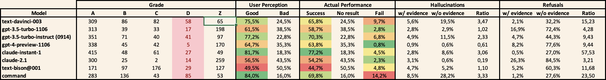

# 🤖🏆 promptrank

A tool to perform grading and ELO ranking of LLM prompts.

## Setup

Copy `dotenv.template` to `.env` and provide your API keys / credentials for LLM providers. Currently, the tool supports OpenAI GPT, Anthropic Claude, Cohere Complete, and Google PaLM2; see `src/llm`


## Competitions

You will define a **competition** that reflects a type of task to be performed by the LLM, e.g. summarization of text. Within the competition, you define **players** that participate, consisting of the respective LLM and temperature/prompt, as well as **player sets** that define a selection of players that you wish to evaluate. Finally, you need to supply **challenges** that are different input specimen for the players to perform on.

Included are skeletons for two competitions: 
- **summarize** that aims to perform sumamrization of raw text scraped from a website; see `competitions/summarize`
- **answer** that answers a question based on text excerpts from documents; see `competitions/answer`

For example, one player of the summarizer competition is defined as:

```yaml
---
    model: text-davinci-003
    temperature: 0.0
    prompt: |-
        Write a summary of the following web page:
        
        ===BEGIN===
        {input}
        ===END===
        
        Summary:
```

## Tournaments

Next, you set up one or more **tournaments** within the competition, which evaluate the performance of players on the challenges.

Tournaments can be **comparisons**, performing pair-wise winn/draw/loss evalaution of performance and calculating resulting match scores and ELO. To define a comparison tournament, provide an evaluation prompt, as found in `competitions/summarize/tournaments/accuracy/comparision.yaml`

 Or they can be **gradings**, in which case each player's performances are individually graded. To define a grading tournament, see `competitions/answer/tournaments/precision/grading.yaml`

## Playing matches

You run a tournament by playing matches: `promptrank -c summarizer -t accuracy -p test play -n 10` (in this case competition `summarizer`, tournament `accuracy`, player set `test`)

Tournament state is persisted and matches can be played incrementally; when starting a new round of matches, all previous results that are obsolete (due to updated players, challenges, or evaluation definitions) are automatically discarded and re-run.

For comparison tournaments, the number of plays specified defines how many matches each player pair will perform. For grading tournaments, it defines how many performances of each player will be graded.

The tournament will be played on challenges in sorted order, so that all players see the same challenges.

## Analyzing player performance

Finally, to analyze performance: `promptrank -c summarizer -t accuracy -p test analyze`

The will read the tournaments state and produce analysis output in `competitions/<competition>/analysis/<player set>`.

### Comparison tournaments

For comparison tournaments, this will write a markdown file `analysis.md` in the output directory. You may specify `-q` to obtain a critique of the players' strengths and weaknesses.

#### Example output

1 tournaments: accuracy
6 players
Median 0.43; average 0.50 +/- 0.27 stddev

| Player | Total Score | Total Score Dev | ELO | Accuracy Score | Accuracy Score Dev |
|---|---|---|---|---|---|
**simple-claude-2**|**0.93**<br/>27-2-1|1.6|1648|**0.93**<br/>27-2-1|1.6|
**simple-claude-instant**|**0.75**<br/>22-1-7|0.9|1430|**0.75**<br/>22-1-7|0.9|
**simple-gpt-35-turbo**|**0.47**<br/>13-2-15|-0.1|1158|**0.47**<br/>13-2-15|-0.1|
**simple-gpt-4**|**0.40**<br/>12-0-18|-0.4|1106|**0.40**<br/>12-0-18|-0.4|
**simple-davinci**|**0.30**<br/>8-2-20|-0.8|1019|**0.30**<br/>8-2-20|-0.8|
**simple-bison**|**0.15**<br/>4-1-25|-1.3|889|**0.15**<br/>4-1-25|-1.3|


### Grading tournaments

For grading tournaments, the command will write an XLSX file with all grades into the output directory. You will need to perform further analysis in a separate Excel workflow; you may use the example evaluation on top of it, as found in `competitions/answer/analysis/xmodel/evaluation_xmodel.xlsx`, as inspiration. 

#### Example output



