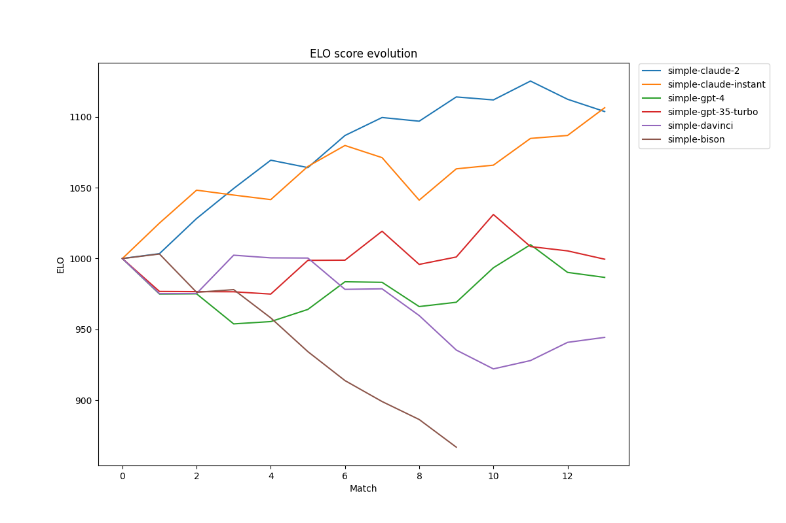

# EXAMPLE competition
## ACCURACY tournament
6 players, 3 challenges, 90 out of 90 matches played

| Player | ELO | Score | Analysis |
|---|---|---|---|
**simple-claude-2**|1205|25-1-4|Simple-claude-2 consistently excels in providing detailed, comprehensive, and accurate summaries that capture more facts and key points from the original text than the opponents.  Weaknesses: - While simple-claude-2's summaries are detailed and comprehensive, they are often less concise than the opponents', potentially making them less accessible and digestible for some readers. - There are instances where simple-claude-2's summaries, despite being more detailed, miss out on some specific details or data points that the opponents' summaries include, indicating a potential area for improvement in thoroughness. - In a few cases, simple-claude-2's summaries are less precise than the opponents', suggesting that the player may sometimes struggle to distill the most important information in a clear and succinct manner.|
**simple-claude-instant**|1056|17-3-10|Simple-claude-instant's key strength lies in their ability to provide detailed, comprehensive, and accurate summaries that often capture more nuances and key points from the original text than their opponents.  Weaknesses: - Simple-claude-instant occasionally includes interpretation and commentary in their summaries, which can detract from the strict fidelity to the original text that is required in this tournament. - There are instances where simple-claude-instant omits important details from the original text, such as specific data points or key events, which can affect the faithfulness and precision of their summaries. - While their summaries are often more detailed and comprehensive, they can sometimes be less concise than their opponents', potentially including unnecessary details and failing to capture the key points in a succinct manner.|
**simple-gpt-35-turbo**|1038|15-2-13|The key strength of the player simple-gpt-35-turbo is its ability to provide concise, precise, and accurate summaries that effectively capture the key points of the original text.  Weaknesses of the player simple-gpt-35-turbo include: - Although the summaries are generally accurate, they occasionally lack detail and omit important points or facts from the original text, which can result in a less comprehensive summary. - The player sometimes fails to include specific details or statistics from the original text, which can reduce the precision and comprehensiveness of the summary. - There are instances where the player does not capture all the nuances of the original text, such as specific perspectives or additional facts, which can limit the depth and richness of the summary.|
**simple-gpt-4**|1009|14-3-13|Simple-gpt-4's key strength is its ability to provide accurate, faithful, and precise summaries without adding any additional information or interpretation.  Weaknesses: - simple-gpt-4 often omits important details and key points from the original text, resulting in less comprehensive summaries compared to its opponents. - The player sometimes fails to include specific statistics and facts from the original text, which can limit the depth and understanding of the summary. - simple-gpt-4's summaries can lack detail and comprehensiveness, often missing out on nuances and subtleties present in the original text.|
**simple-davinci**|917|10-1-19|The key strength of the player simple-davinci is their ability to provide accurate, concise, and faithful summaries of the original text without adding unnecessary interpretation or commentary.  Weaknesses of the player simple-davinci include:  - Lack of detail and specificity: In many assessments, simple-davinci's summaries were criticized for lacking the level of detail and specificity that the opponent's summaries had. This includes missing out on key statistics, specific points, and nuances from the original text. - Inconsistency in comprehensiveness: While in some instances simple-davinci's summaries were praised for being comprehensive, in others they were noted to be less comprehensive than the opponent's, indicating a lack of consistency in capturing all key points from the original text. - Addition of extraneous information: In a few assessments, simple-davinci was noted to have included information in their summaries that was not fully covered in the original text, indicating a tendency to add unnecessary or extraneous information.|
**simple-bison**|765|4-0-26|The key strength of the player simple-bison is their ability to provide concise, accurate, and faithful summaries that strictly adhere to the original text without adding any additional information or interpretation.  Weaknesses of the player simple-bison include: - Lack of comprehensiveness: simple-bison often omits important details, key points, and specific statistics from the original text, resulting in summaries that, while accurate, are less detailed and comprehensive than those of their opponents. - Inconsistency in participation: simple-bison sometimes does not provide any summary at all, which significantly undermines their performance in the tournament. - Failure to capture the full scope of the original text: simple-bison's summaries, while concise and accurate, often fail to capture the full scope of the original text, including the actions of major retailers, the impact of the cost-of-living crisis on partnerships, the role of AI, and the most admired partnerships.|

### ELO score development
