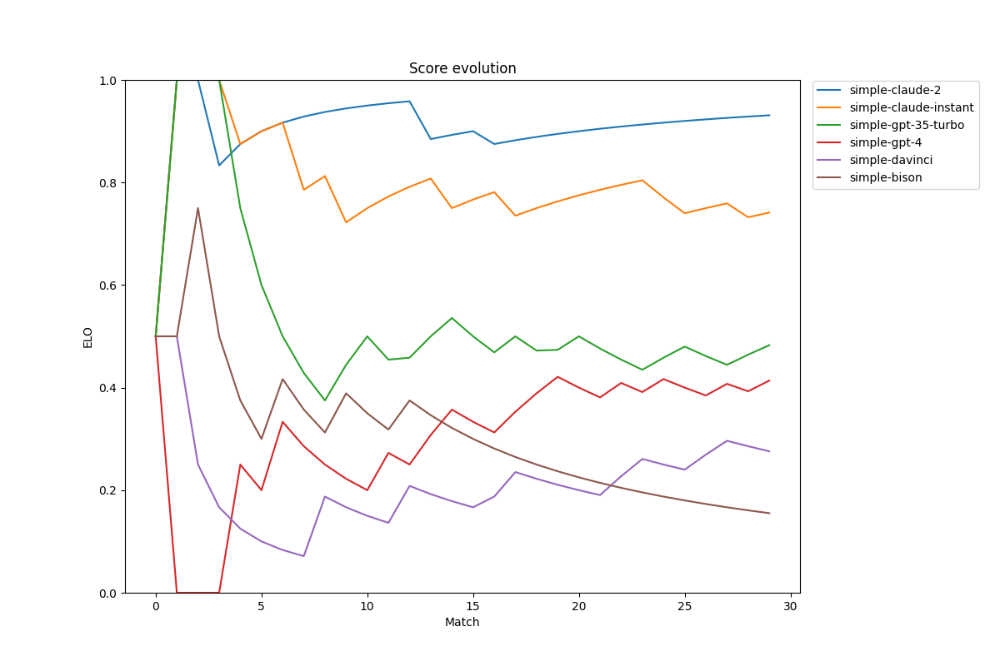
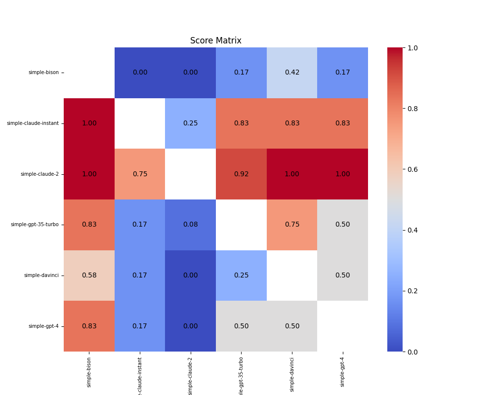
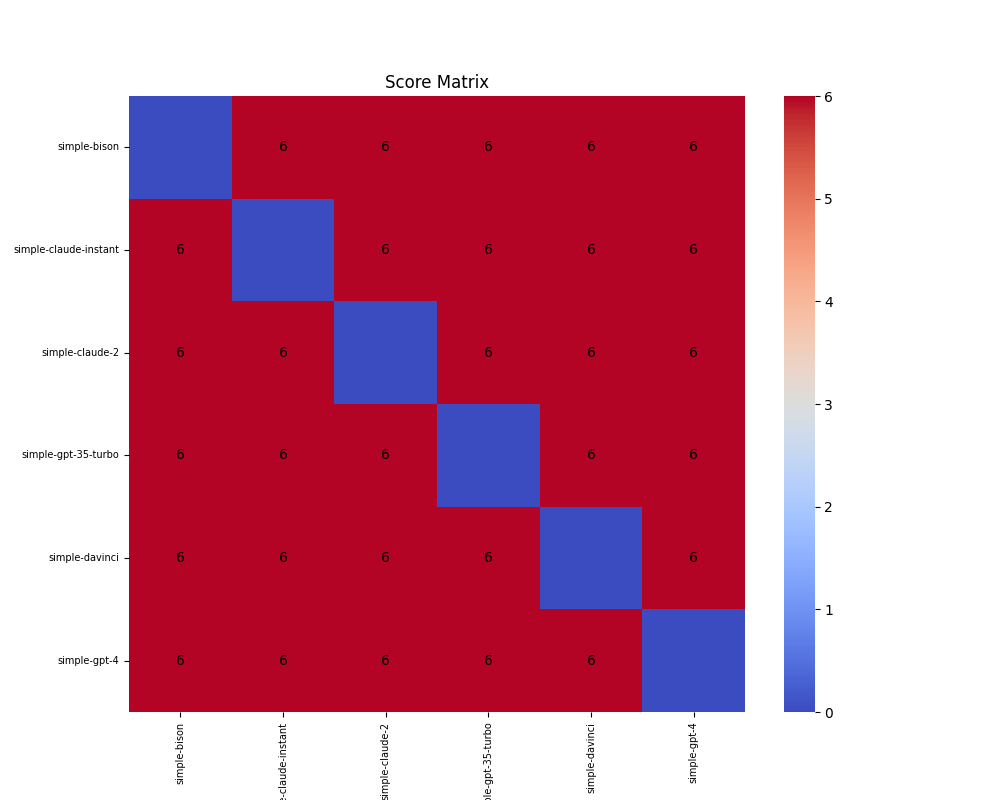

## Example / Accuracy / test
6 players, 3 challenges, 90 out of 90 matches played

Median 0.43; average 0.50 +/- 0.27 stddev

| Player | Score | Score Dev | ELO | Analysis |
|---|---|---|---|---|
**simple-claude-2**|**0.93**: 27-2-1|1.6|1648|n/a|
**simple-claude-instant**|**0.75**: 22-1-7|0.9|1430|n/a|
**simple-gpt-35-turbo**|**0.47**: 13-2-15|-0.1|1158|n/a|
**simple-gpt-4**|**0.40**: 12-0-18|-0.4|1106|n/a|
**simple-davinci**|**0.30**: 8-2-20|-0.8|1019|n/a|
**simple-bison**|**0.15**: 4-1-25|-1.3|889|n/a|

### Score History

### Score Matrix

### Game Matrix
